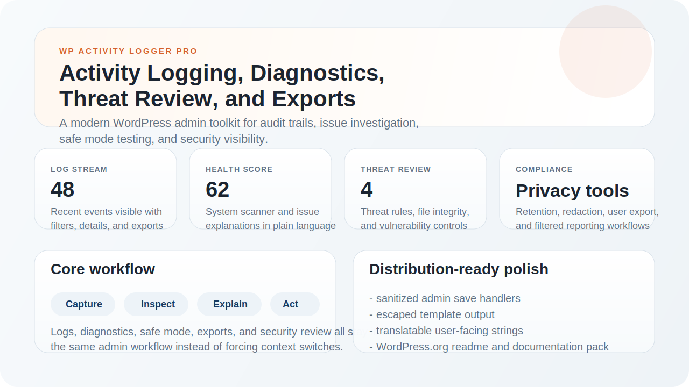

# TracePilot for WordPress

TracePilot for WordPress is a modern WordPress activity log, diagnostics, and threat-review plugin built for administrators who need visibility, traceability, and safer debugging tools inside wp-admin.



## Overview

The plugin combines several admin-focused workflows in one place:

- Activity logging for user and system events
- Searchable audit trails with filters and exports
- Diagnostics and conflict detection with safe mode debugging
- Threat detection, file integrity checks, and vulnerability intelligence settings
- Privacy tools for user log export/delete requests

## Highlights

### Activity logging

- Tracks user and system actions
- Stores severity, IP, role, object, and context data
- Provides a modern log stream and detailed modal view
- Supports multisite-aware retrieval on supported screens

### Diagnostics and conflict detection

- Runs a system scan and assigns a health score
- Explains technical issues in plain language
- Builds issue history and change correlation
- Includes admin-session safe mode for conflict testing

### Security workflow

- Threat detection rules for suspicious behavior
- File integrity baseline and comparison tools
- Vulnerability intelligence settings for Wordfence, Patchstack, and WPScan
- Alert routing for email and supported webhook channels

### Privacy and compliance

- IP anonymization
- Context redaction keys
- Retention controls
- Per-user export and delete tools

## Included admin areas

- Dashboard
- Activity Logs
- Analytics
- Threat Detection
- Server Recommendations
- Diagnostics
- Search Console
- Archive
- Export
- Settings

## Installation

1. Upload the plugin to `wp-content/plugins/tracepilot-for-wordpress`.
2. Activate it from the WordPress `Plugins` screen.
3. Open `TracePilot` from the admin menu.
4. Configure privacy, notifications, diagnostics, and threat detection settings to match your site.

## Documentation map

- [Installation guide](docs/installation.md)
- [User guide](docs/user-guide.md)
- [FAQ](docs/faq.md)
- [Developer guide](docs/developer-guide.md)

## WordPress standards pass

This repository has been tightened toward WordPress plugin standards:

- admin inputs are sanitized before save
- key AJAX requests use nonce checks and capability checks
- major admin outputs are escaped
- user-facing strings are wrapped for translation
- metadata and readme files are aligned for WordPress distribution

## Developer example

```php
TracePilot_Helpers::init();

TracePilot_Helpers::log_activity(
    'custom_action',
    __('Custom action recorded from another plugin.', 'wp-activity-logger-pro'),
    'info',
    array(
        'object_type' => 'integration',
        'object_name' => 'Example integration',
    )
);
```

## Author

- Author: Rashed Hossain
- Website: [https://rashed.im/](https://rashed.im/)
- WordPress.org: [wprashed](https://profiles.wordpress.org/wprashed/)

## Version

Current documented release: `1.3.1`
